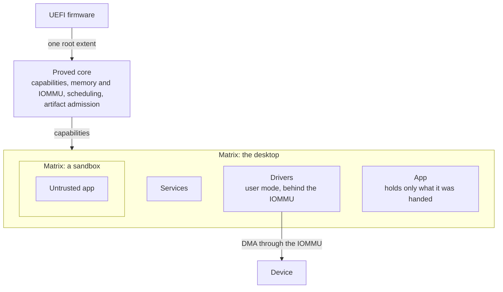

# Cathedral

Cathedral is an operating system with instant file searches, strict performance requirements, and virtually no malware by design. The user is sovereign; no software can do anything except that which it has been granted.

Malicious software goes no further than the files, network access, and devices it was given. Every one of those permissions can be revoked. By default, these permissions are incredibly scoped. Apps cannot go poking where they do not belong.

Apps can be arbitrarily sandboxed, at almost no cost, by running them in cheap operating system clones called **Matrices**.

This is made possible by the underlying filesystem database, which allows for near-free copying and searching, and prevents data corruption. This also means 'cloning all system' is free, giving apps the illusion of their own environments.

Cathedral supports update-in-place, removing the need for the vast majority of "restart to update" prompts that plague legacy operating systems.

**Pre-alpha.** Cathedral is in the design and early-boot phase. The Omega-emitted UEFI image boots under QEMU and OVMF, exits firmware, takes custody of one root memory extent, and reports over a 16550 UART. There is no kernel, scheduler, component runtime, or production driver yet. Each contract is being specified before the system hardens around it.

[Documentation map](wiki/README.md) ·
[Specification](wiki/spec/README.md) ·
[Design](wiki/design/design.md) ·
[Boot walkthrough](wiki/boot/boot_sequence.md) ·
[Porting queue](TASKS_RUST_OSDEV_PORTS.md)

## Solved problems

| Legacy OS | Cathedral | How |
| --- | --- | --- |
| Copying large folders takes an eternity | Copying is instant, regardless of size. You pay when the copy changes or moves to another device. | Copy-on-write. The folder tree is decoupled from storage. |
| Searching files is slow | Search and filter run at database speed. | Files live in a database. |
| A crash or power loss corrupts your files | You land at the last consistent commit. Any object rolls back to the state before a bad change. | Storage is one transactional, versioned object store. [Filesystem as database](wiki/design/part_4_storage/00_filesystem_as_database.md) |
| Backups are manual | Files get automatic history checkpoints and can replicate across your drives. | Versioning is free under copy-on-write. |
| Updates need a reboot | Drivers, services, and compatible core changes hot-swap live, with rollback. A change that cannot prove a safe live path defers to reboot. | State migrates through checked code at a quiet point. [Updates and hot swap](wiki/design/part_5_lifecycle/01_updates_and_hot_swap.md) |
| Malware and ransomware | A compromised program, a backdoored dependency, or a hijacked agent can damage only the data it was granted. Each grant is attributable and revocable. | No ambient authority. [Capability model](wiki/design/part_1_authority/00_capability_model.md) |
| A buggy driver takes the machine down | It takes its device down, then restarts. | Drivers are confined user-mode components behind a mandatory IOMMU. [Driver model](wiki/design/part_5_lifecycle/02_driver_model.md) |
| System files clutter the disk | The disk is yours. System files live in their own realm, and each app owns a realm under its binary. | Storage is partitioned into capability-rooted realms with no global root. |
| Sandboxing needs a container runtime or a guest OS | A nested Cathedral, called a Matrix, is the sandbox. The desktop itself is one. | A Matrix owns everything its children can see. [Sandboxing](wiki/design/part_1_authority/03_security_policy_and_sandboxing.md) |
| An agent with your keys can leak them | An agent holds the right to use a secret, never its bytes. A prompt-injected agent cannot exfiltrate what it never held. The worst case is "use this key, read-only, rate-limited, inside this sandbox." | Secrets are capabilities. [Agents as principals](wiki/design/part_1_authority/06_agents_as_principals.md) |

Because the desktop is itself a Matrix, malware cannot tell whether it is sandboxed. Everything is.

## Architecture

Everything above follows from one rule: authority is a capability a program holds, never something it gets for free by being run. Cathedral is written in [Omega](https://github.com/CathedralOS/Omega), a language built alongside it that checks who holds what at compile time, so the rule holds by construction rather than by convention.

Every part of the system is either proved or caged. The core is written in checked Omega and trusted in full. It is what builds the cages, so nothing sits above it to confine it. Everything else, drivers included, is confined by hardware and holds only the capabilities it was granted.



A Matrix is a nested Cathedral. It owns everything its children can see: their files, devices, clock, and network. The desktop is a Matrix, a sandbox is a Matrix, and a Matrix inside a sandbox is one more level of the same thing. System files are shared into each one read-only, so a new Matrix costs a set of grants rather than a guest OS. Virtual machines stay around for foreign operating systems.

## The bet

Every OS domain has a legacy contract, and most of them cannot answer a simple question: who can do what, why, through which path, and can I revoke it safely? Cathedral answers it by construction. Omega makes authority, effects, protocols, and state evolution visible to the compiler before a byte is emitted, so each contract is rebuilt on top of that instead of bolted on.

That means rebuilding every contract, not one:

| Domain | Legacy contract | Cathedral contract |
| --- | --- | --- |
| Authority | Users, groups, ACLs, sudo, seccomp, namespaces, all at once | One capability model. Nothing ambient. |
| Storage | A tree of byte files under a global root | A content-addressed database of typed objects, split into capability-rooted realms |
| IPC | Pipes, sockets, signals, dbus, each its own kernel mechanism | One capability-scoped shared region. Every pattern is a library over it. |
| Drivers | Kernel mode, trusted, one bug from a panic | Confined user-mode components behind an IOMMU |
| Isolation | Containers and guest kernels | Nested Matrices. Virtual machines only for foreign operating systems. |
| Updates | Replace files, reboot | Declarative, hot-swappable state transitions with rollback |
| The core | A monolith you cannot replace while running | A small proved core whose components hot-swap where a safe live path can be proved |

One technique here shares ground with [Theseus](https://www.theseus-os.com/): a single address space with language-level isolation and live component replacement, used for the proved core. It is one idea in Cathedral, not the thesis.

## Repository layout

```text
wiki/          specifications, design, architecture, explainers, proposals, drafts
source/
  contracts/   the frozen ABI
  core/        the proved kernel: the trusted computing base
  boot/        the firmware seam
  drivers/     user-mode, contained, not trusted
  libraries/   hardware and protocol libraries
tools/         host-side tooling that never ships
```

`foundation/`, `services/`, and `applications/` are planned under `source/` and appear when real code lands. The dependency rules are in [repository_layout.md](wiki/architecture/repository_layout.md), the trusted set is enumerated in [tcb.md](wiki/architecture/tcb.md), and the decision is recorded in [ADR 0001](wiki/decisions/0001-repository-layout.md).

## Documentation

Start at the [documentation map](wiki/README.md). It separates what is promised (the specification) from why (design) and from what is still being explored (proposals, drafts, speculation). The [design index](wiki/design/design.md) has the reading path and the chapter map.

## Relationship to Omega

The two repositories evolve together. Omega supplies the proof, effect, capability, and versioned-data machinery. Cathedral is the first system large enough to put real pressure on it. Where a chapter needs a language feature Omega does not have yet, it says so and links the Omega chapter.

The chapters Cathedral leans on most:

- [Capabilities, Effects, And Boundaries](https://github.com/CathedralOS/Omega/blob/main/wiki/language_guide/chapter_19_capabilities_effects_boundaries.md)
- [Domains](https://github.com/CathedralOS/Omega/blob/main/wiki/language_guide/chapter_8_domains.md)
- [Machines](https://github.com/CathedralOS/Omega/blob/main/wiki/language_guide/chapter_3_machines.md) and [States And Transitions](https://github.com/CathedralOS/Omega/blob/main/wiki/language_guide/chapter_4_states_transitions.md)
- [Versioned Data](https://github.com/CathedralOS/Omega/blob/main/wiki/language_guide/chapter_14_traits.md#versioned-data)
- [Wire Protocols](https://github.com/CathedralOS/Omega/blob/main/wiki/language_guide/chapter_14_traits.md#wire-protocols)
- [Proof Obligations](https://github.com/CathedralOS/Omega/blob/main/wiki/language_guide/chapter_9_proof_obligations.md)
