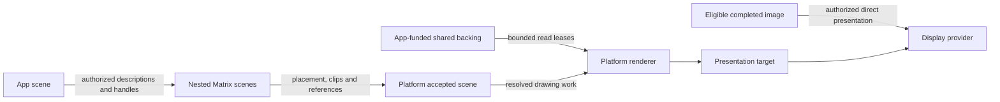

# Rendering, composition and resource custody

Rendering should preserve the Matrix authority tree without requiring an image
and a pixel copy at every ancestor. This proposal separates retained scene
descriptions, resource backing, execution and presentation.

| Status | Scope |
| --- | --- |
| Proposed | Candidate architecture, not an accepted Cathedral contract |
| Specification coverage | Unwritten; ownership is recorded in the [specification index](../spec/README.md) |
| Implementation evidence | Bounded Rust drawing, shared-page and rendering experiments; no retained scene service or GPU backend |

## Read by responsibility

This page owns the problem, architectural split and alternatives. Descend into
the page that owns the next question:

| Question | Owner |
| --- | --- |
| What does an app submit, and how do Matrices nest? | [Scene submission](0000_rendering_and_composition/scene_submission.md) |
| Who stores, pays for, reads and releases images and text resources? | [Resource custody](0000_rendering_and_composition/resource_custody.md) |
| How do software, GPU execution and scanout differ? | [Execution and presentation](0000_rendering_and_composition/execution_and_presentation.md) |
| What exists, what conflicts, and what would establish the proposal? | [Evidence and acceptance](0000_rendering_and_composition/evidence_and_acceptance.md) |

## Problem and boundary

Existing graphics systems distinguish drawing APIs, shared image resources and
presentation. A shared buffer can cross a process boundary by reference, while
composition still reads its pixels into another image. Linux's
[DMA-BUF model](https://docs.kernel.org/driver-api/dma-buf.html) separates buffer
exporters, importers and completion synchronization. Neither sharing nor a small
drawing command guarantees cheap rendering.

Cathedral adds recursive hosts. An app can implement its children's compositor,
control their placement and input, and present them upward. Requiring each host
to rasterize its subtree would tie pixel traffic to Matrix depth. Giving every
host writable access to the final target would instead join their trust domains.
The design needs a route between those choices.

## Proposed ownership

The platform owns common drawing and presentation mechanisms. Distribution and
application code choose appearance, layout, widgets and behavior, subject to
the platform's protected interaction boundary.

| Owner | Responsibility |
| --- | --- |
| App or nested Matrix | Local scene, child placement, resource production and delegated presentation rights |
| Platform scene service | Accepted scene revisions, authority checks, resource references and scheduling |
| Platform renderer | Validated drawing execution, derived caches and target writes |
| Display/GPU provider | Device access, image import, hardware completion and presentation |
| Kernel | Isolation, memory custody, IPC and scheduling mechanisms; no glyph, path or window policy |

These are responsibility boundaries. They do not require one process per row.
Being a Cathedral system process does not grant access to all output memory.
Any process holding such access belongs to the relevant display trust boundary.

The app remains authoritative for its desired content. The scene service owns
the accepted presentation state within its output domain. That bookkeeping does
not imply ownership of every resource allocation or permission to read app memory.

The diagram omits input routing and protected prompt policy, which remain owned
by [[windowing_and_compositor]]. Flattening drawing work does not bypass a host's
delegation, observation or interception rights.

The [input and pointer proposal](0001_input_and_pointer_leases.md) develops
source bindings, scoped pointer authority and cursor attribution. Cursor assets
use this proposal's resource custody; permission to draw a cursor does not grant
permission to deliver input through it.

## Alternatives and tradeoffs

| Route | Benefit | Cost or limitation |
| --- | --- | --- |
| Every app submits finished images | Supports arbitrary rendering stacks | Usually needs final composition; materializing every ancestor adds more work |
| Every app submits bounded drawing descriptions | Platform controls target writes and can combine work | Adds drawing semantics, validation and resource management to the platform |
| Both descriptions and completed images | Ordinary UI can share rendering machinery while custom engines retain control | Requires a common lifetime/presentation model and an image-import path |
| Native writers share arbitrary target spans | Can remove intermediate storage for cooperating code | Ordinary page mappings cannot enforce arbitrary sub-page spans |
| Proved or sandboxed direct writers | Could enforce finer write authority | Requires a defined admission, access and termination model; absent from the Rust lab |

The proposed direction is descriptions plus completed-image presentation. Row
borrows remain a possible internal renderer technique. No requirement here makes
all apps use a platform toolkit, adopts full SVG, or guarantees zero copies.

## Contract ownership and acceptance

The intended rendering contract owner is `spec/human_surface/rendering.md`.
Compositor/seat authority remains at `spec/human_surface/compositor_and_seat.md`.
Shared-resource and revocation semantics also depend on the intended authority,
IPC and component specifications listed in the index. No empty specification
pages or production wire schemas are introduced by this proposal.

Owner choices live in [OWNER_QUESTIONS.md](../../OWNER_QUESTIONS.md), particularly
platform drawing placement, writable spans, and accepted-lease revocation. The
[evidence page](0000_rendering_and_composition/evidence_and_acceptance.md) links
each conflict and separates experiments from acceptance requirements.

Acceptance records the chosen rules in their specification owners and updates
affected machine-readable contracts and design chapters. Material not accepted
remains proposed. Incorporated or superseded proposal text is removed, with Git
retaining its history.
