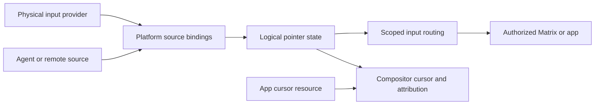

# Input sources and scoped pointer leases

The platform should route input through logical pointers that can be driven by
authorized sources. A hardware mouse is one source. A Matrix can delegate a
pointer within its own subtree without handing an app the operator's mouse or
keyboard focus.

| Status | Scope |
| --- | --- |
| Proposed | Candidate architecture, not an accepted Cathedral contract |
| Specification owner | Unwritten `spec/human_surface/compositor_and_seat.md`; see the [coverage map](../spec/README.md) |
| Implementation evidence | [Rust input transport](../../source-rs/contracts/input.rs) carries physical-key events; pointer routing and cursor leases are absent |

## Separate the objects

The [windowing design](../design/part_6_human_surface/00_windowing_and_compositor.md)
already anticipates multiple labeled cursors, agents and remote collaboration.
It describes each seat as a cursor plus keyboard focus. Lightweight pointers
inside a Matrix need a clearer separation between motion, visual presence and
permission to act.

| Object | Responsibility |
| --- | --- |
| Input source | Produces normalized events from a device, agent, remote participant or replay |
| Source binding | Grants a source permission to drive a particular logical pointer; retains trusted provenance |
| Logical pointer | Tracks identity, position, button state and capture within an authorized coordinate space |
| Cursor visual | Presents the pointer's sprite, hotspot, visibility and attribution |
| Pointer lease | Delegates specified control or observation rights within a Matrix subtree and lifetime |
| Seat | Associates an acting principal with an input-routing and focus context; its relationship to multiple pointers remains an owner choice |

A pointer's identifier is not a capability. Knowing it does not grant motion,
button injection, observation or capture. A visual-only collaboration marker
needs no authority to activate controls. Permission to move an actionable
pointer need not include keyboard focus or the right to drive another pointer.

The platform owns binding, routing and attribution rules. A distribution supplies
the default device profile and presentation choices within those rules. The
kernel supplies isolation, device access and IPC mechanisms; it need not know
cursor names, pointer acceleration or which child is under a cursor.

## Default pointer and multiplexing

Startup policy can create an operator pointer and permit local mouse devices to
drive it. Another profile can give each device its own pointer. A remote session
or app can receive a separate lease without replacing that default binding.

ZII describes a useful empty state, not an ambient grant. A zero or absent pointer
lease is inert. Creating the default pointer and attaching hardware requires
established authority, consistent with the
[substrate's zero-state rule](../design/part_0_foundations/01_omega_substrate.md).

Multiplexing belongs above normalized device input. Keep source identity and
held-button state until the binding policy combines them. If two sources share
a pointer, one source releasing a button must not erase the other source's held
state. Device removal must retire that source's contribution. The contract must
choose an aggregation or exclusive-control policy and define event ordering.

Hardware origin is a property established by the trusted input path. An app
cannot manufacture it by naming a pointer "operator" or feeding a pointer that
also has a physical binding. Human-only confirmation and the reserved operator
escape must consult trusted origin and binding state, not just pointer identity.
This preserves the existing design's physical-input backstop without assuming
that every event on a mixed pointer was physically generated.

## Delegation inside a Matrix

A host can delegate pointer rights only within authority it holds. A child lease
names its subtree, coordinate space, permitted operations and lifetime. Moving
outside its bounds, reaching siblings or targeting the root's protected prompts
requires authority that the child lease does not supply.

Each hosting level applies its transforms and routing restrictions. Flattening
the scene for drawing does not bypass input interception, clipping or occlusion.
Input routing and rendering need a defined scene revision relationship so the
visible target and the hit-tested target agree under movement and reparenting.
Choosing accepted versus presented state, including the treatment of queued
events, remains specification work.

Capture belongs to a particular pointer, target and grant. A pointer lease alone
does not hide the operator's cursor, capture another pointer or transfer keyboard
focus. Focus-on-click can be an authorized policy; it is not an automatic power
of every cursor visible within a Matrix.

For example, a collaborative editor could host three participant pointers and
one agent pointer. A participant might receive a visual marker only, while the
agent receives bounded motion and activation within the document. The local
operator keeps an independent pointer and the reserved escape path.

## Rendering cursors and names

An app may supply a cursor asset and request a hotspot, style or descriptive tag.
The compositor renders the accepted visual and derives trusted attribution from
the acting principal. An app-supplied name cannot replace that identity or claim
to be an operator or system prompt. Distribution styling must preserve the
eventual trusted-indicator contract, whose boundary is still an
[owner question](../../OWNER_QUESTIONS.md#replaceable-distribution-versus-permanent-os-chrome).

Cursor assets use the same bounded resource registration and read-lease model
as the [rendering proposal](0000_rendering_and_composition.md). Moving a cursor
updates position; it does not require uploading its bitmap again or rasterizing
every ancestor Matrix. Resource loss needs a platform-controlled fallback so an
actionable pointer cannot lose required attribution because an app stopped
serving its asset.

An app may also draw decorative pointers into its own content. Those pixels
confer no input authority and cannot replace the protected cursor over a trusted
prompt. This distinction permits custom visuals while retaining the windowing
design's rule that the compositor owns the real cursor.

## Lifetime and bounded work

Pointer state and queued events must distinguish lease incarnations. Reusing an
identifier after app death must not deliver old motion or clicks to its successor.
Revocation, source loss, target loss and host death need defined capture release
and cancellation behavior. Clearing a drag must not synthesize a successful click
on a different target.

The current focus chapter says already-queued events drain. Pointer revocation
needs that reconciled with cancellation and the
[pending-IPC question](../../OWNER_QUESTIONS.md#endpoint-transport-and-revocation-of-pending-ipc).
This proposal does not decide that revocation undoes committed input. The final
contract must identify the commitment point and how held state is cleared on
both sides without authorizing new actions.

Bound pointer count, event queues, update work and cursor-resource residency
separately. A large shared bitmap is not permission to create unlimited cursors.
Motion can be coalesced only where the chosen event mode permits it; button and
capture transitions need ordered delivery or an explicit reset protocol. Reserve
enough platform capacity for operator recovery under a flooding source. Exact
ceilings and fair scheduling are implementation choices within that guarantee.

## Alternatives and open authority choice

| Model | Consequence |
| --- | --- |
| Every pointer is a complete seat | Uniform principal and focus bundle, but even a lightweight cursor introduces another keyboard-focus context |
| Pointers are separately leased within an explicit seat context | Supports multiple cursors without multiplying keyboard focus; requires rules for pointer-to-seat association and focus changes |
| App draws all extra cursors as ordinary content | Sufficient for decoration; lacks platform-attributed interaction and common capture/lifetime handling |

The proposed direction is separately leased pointers with explicit seat
association. The [owner question](../../OWNER_QUESTIONS.md#pointer-leases-seats-and-action-authority)
records the conflict with the current seat wording. It also leaves open whether
an app receives distinct pointer streams or opts into an adapter for one active
pointer. Such an adapter must retain principal boundaries and define arbitration;
silently merging independent actors into one apparent human is not acceptable
under this proposal.

## Acceptance evidence

Before promoting this proposal to a contract, establish:

- Two physical sources sharing a pointer, and two independent pointers, with
  ordered button handling across disconnect and source rebinding.
- A visual-only lease that cannot activate controls, and an actionable child
  lease that cannot reach siblings, ancestors or protected prompts.
- Nested transforms, clipping, occlusion and scene changes with matching visible
  cursor position and routed targets.
- Capture cancellation, source/target/host death and stale queued events without
  stuck state, inherited authority or a click on a replacement target.
- App-provided cursor assets with platform attribution, bounded resources and a
  failure fallback that retains the required identity cue.
- Synthetic input on a pointer with a physical binding that cannot pass a
  physical-origin gate or suppress operator recovery.
- Explicit seat/focus and compatibility-adapter rules, with budgets that keep
  an abusive source from monopolizing routing and cursor updates.

These are future conformance requirements. The Rust key-event transport supplies
no evidence for them yet. Acceptance updates the compositor/seat specification,
affected source contracts and the conflicting seat and agent design prose.
